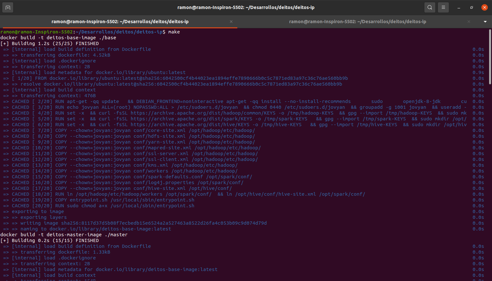
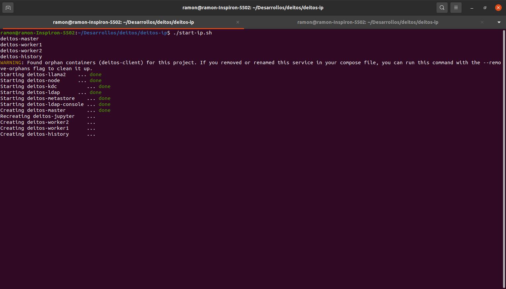
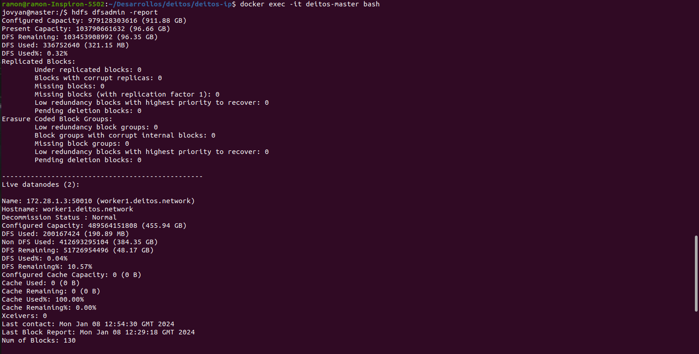
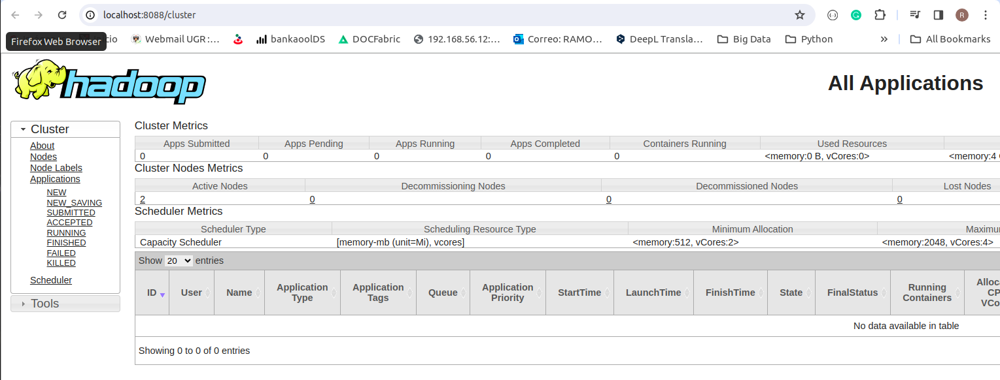
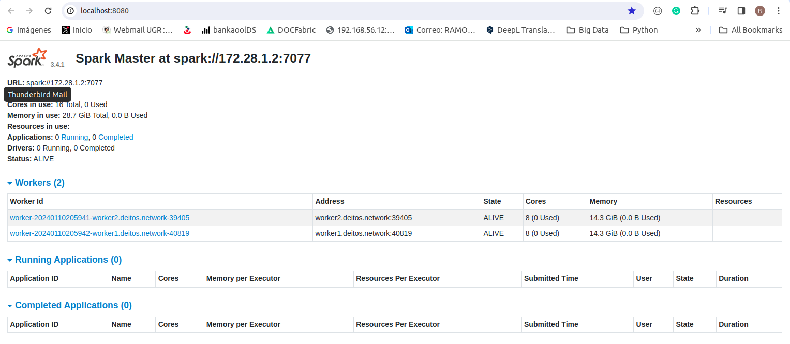
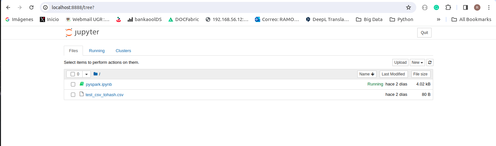
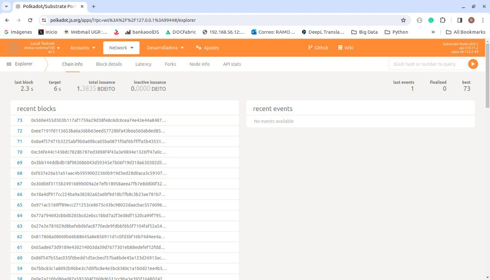
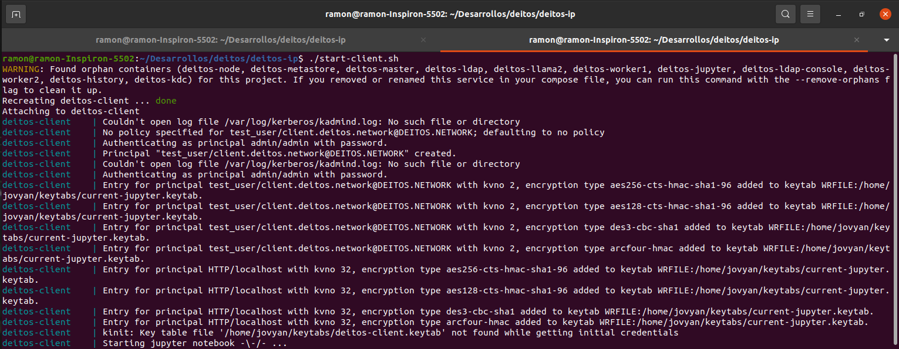
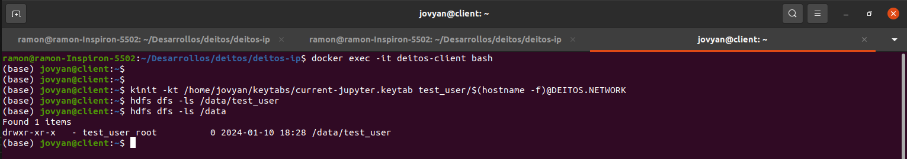
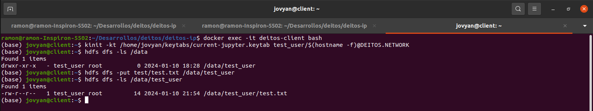

## 🚧🚧 Under Construction 🚧🚧

# Deitos Network for Infraestructure Provider

Deitos incorporates blockchain technology to transform the consumption of Big Data and AI services. 

This project shows how a set of containers can be deployed on the side of an infrastructure provider to start a [Deitos Node](https://github.com/Deitos-Network/deitos-node) and a set of Hadoop-based services (Hadoop / Spark / Hive), it also shows the deployment of a Jupyter-based client that can use the services offered by the infrastructure provider and Llama v2 for LLM processing.

## Infrastructure provider services


On the side of the infrastructure provider, a Hadoop Cluster is installed, with 1 NameNode and 1 Datanode, also, a Spark Cluster is installed with 1 Driver and 1 Slave. 

### Software Used

* [Hadoop 3.3.6](https://hadoop.apache.org/)
* [Hive 3.1.3](http://hive.apache.org/)
* [Spark 3.4.1](https://spark.apache.org/)

### OS Compatibility and Support

As of the current release, the technology stack for Infrastructure Providers in the is exclusively compatible with Linux distributions. Future updates may expand OS support based on user needs and technological advancements.


### Starting Infraestructure Provider Services

It is required to start the Services in the Infrastructure Provider, in this sense, it is necessary to build the docker images and invoke the corresponding startup script.

Build de docker images:
```
make
```



Start the Docker containers in Infraestructure Provide:
```
./start-ip.sh
```


It is necessary to verify if the services have been started correctly, for this we will enter the node master of the Docker deployment, and verify the status of the data nodes that make up the Hadoop cluster, for this we execute the following command:

1. Enter into master node using the command in your bash session: 
```
docker exec -it deitos-master bash
```
2. Execute HDFS command that gives a detailed report on the health status of the Cluster.:
```
hdfs dfsadmin -report 
```
You should get a output similar to the next:


In the attached image you can verify that the cluster is composed by  2 datanodes and both are alive, one of them is called worker1.deitos.network.

**❗ IMPORTANT: Please note that the process of starting the hadoop cluster may take some time, depending on the hardware resources of your machine. Please wait a couple of minutes until everything gets syncronized.**

### Checking Other Services

Several services run within the Hadoop cluster, such as the Yarn resource scheduler and the Spark distributed scripting engine, and you can view their running status using the web browser and accessing the corresponding monitoring consoles.

For YARN service status 

ResourceManager: http://localhost:8088



master: http://localhost:8080



On the infrastructure provider side, you can access the Jupyter programming interface, with which you can test the use of Spark / Hadoop and Hive through a Notebook example, once validated in the system. 

URL: http://localhost:8888
example: [jupyter/notebook/pyspark.ipynb](http://localhost:8888/notebooks/pyspark.ipynb)



## Deitos Blockchain Node

The [latest release of a Deitos Blockchain Node](https://github.com/Deitos-Network/deitos-node/releases/tag/v0.0.1) is included as part of the IP technology stack.

The Deitos Node can be accessed using PolkadotJS with the following URL:

```
https://polkadot.js.org/apps/?rpc=ws%3A%2F%2F127.0.0.1%3A9944#/explorer
```



Please Make sure that no other substrate node is running under the default ports like 9944 or 30333.

## Client services

Docker instance  provides a Jupyter-based service to test the functionalities of the services offered through a sample Python-based notebook, and also allows working on command line to test different instructions to use the services offered by the infrastructure provider.

### Starting Client

To start the client services, run the corresponding script command:
```
./start-client.sh
```




### Testing Services Hadoop using Command-line

To test the services we will need to login to the client docker node, validate in kerberos using a keytab file corresponding to a test user that was created during the installation process.

Enter into deitos-client node using the command in your bash session: 
```
docker exec -it deitos-client bash
```

To verify access to the services, we authenticate to kerberos with the user named test_user and run a command to list the directories in the root of the HDFS file system.

```
# Autheticate User
kinit -kt /home/jovyan/keytabs/current-jupyter.keytab test_user/$(hostname -f)@DEITOS.NETWORK

# Make ls to HDFS Filesystem
hdfs dfs -ls /data/test_user
```



It is possible to upload a sample file to a specific path in the HDFS file system hosted on the client node. We can use the command:
```
hdfs dfs -put test/test.txt /data/test_user
```

Show results of Execution:



### Testing Services Hadoop using WebHDFS

Among the services deployed in the Infrastructure Provider is the WebHDFS Rest API, which allows performing operations with the HDFS file system. To do this, the jovyan user is used to list directories in a specific path of the file system and upload a file to a specific location.

The examples and tests presented below are performed using the curl command, which provides a lot of flexibility.

For make this activies, in necessary create a bash session in your local machina using the command: 
```
bash
```


Edit file /etc/hosts and add entries for deitos containers:
```
sudo /etc/hosts

#Add entries to /etc/hosts file 

127.0.0.1   	master.deitos.network
127.0.0.1	worker1.deitos.network
```


To interact with the API execute the following sequence of commands using the curl command, note that each instruction is documented with a comment indicating the operation and usefulness of the command:


```
# Get Delegation Token
curl -v -i  "http://master.deitos.network:50070/webhdfs/v1/data/test_user?user.name=jovyan&op=GETDELEGATIONTOKEN"


# List Directory
curl -v -i  "http://master.deitos.network:50070/webhdfs/v1/?user.name=jovyan&op=LISTSTATUS"

# Define Upload Operation to API - The Response is a Redirect Address to Execute the final Operation
curl -v -i -X PUT "http://master.deitos.network:50070/webhdfs/v1/data/test_user/README.md?user.name=jovyan&op=CREATE"

# Upload File to the API
curl -v -i -X PUT -T README.md "http://worker1.deitos.network:9864/webhdfs/v1/data/test_user/README.md?op=CREATE&user.name=jovyan&namenoderpcaddress=master.deitos.network:8020&createflag=&createparent=true&overwrite=false"

