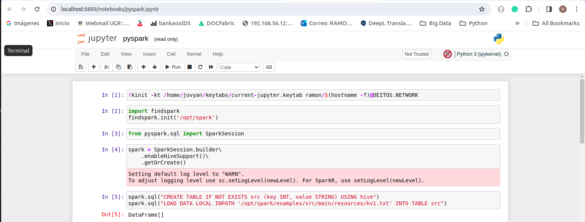

# Deitos Network for Infraestructure Provider

## Software Used

* [Hadoop 3.3.6](https://hadoop.apache.org/)
* [Hive 3.1.3](http://hive.apache.org/)
* [Spark 3.4.1](https://spark.apache.org/)
* [Jupyter 3.4.3](https://jupyter.org/)
* [Llama-2 7B](https://huggingface.co/TheBloke/Llama-2-7B-Chat-GGUF)


## Starting Infraestructure Provider (IP)

To start the services, run:
```
make
./start-ip.sh
```
To begin the work, it is necessary to check that all services are up, to check it execute the following actions.

1. Enter into master node using the command in your bash session: 
```
docker exec -it deitos-master bash
```
2. Once inside, execute the following command:
```
hdfs dfsadmin -report 
```
You should get a output similar to the next:


It is possible that the synchronization of the hadoop cluster may take some time when starting the docker container. Please be patient.

## Checking Hadoop Services (HDFS / YARN / History)

ResourceManager: http://localhost:8088
NameNode: https://localhost:50470
HistoryServer: http://localhost:19888

## Checking Spark Services (Master / Slaves)
master: http://localhost:8080

## Checking Jupyter Notebook
URL: http://localhost:8888
example: [jupyter/notebook/pyspark.ipynb](http://jupyter.deitos.network:8888/notebooks/pyspark.ipynb)


## Starting Deitos Client (deitos-client)

To start the services, run:
```
./start-client.sh
```

## Testing Services Hadoop using command-line

Enter into deitos-client node using the command in your bash session: 
```
docker exec -it deitos-client bash
```

To test the access to the services:
```
# Autheticate User
kinit -kt /home/jovyan/keytabs/current-jupyter.keytab test_user/$(hostname -f)@DEITOS.NETWORK

# Make ls to HDFS Filesystem
hdfs dfs -ls /data/test_user
```

To Upload File to the HDFS cluster using command-line, run:
```
hdfs dfs -put test/test.txt /data/test_user
```

Show results of Execution:


## Testing Services Hadoop using WebHDFS

Enter into deitos-client node using the command in your bash session: 
```
docker exec -it deitos-client bash
```

To Upload File to the HDFS cluster using webHDFS API, execute:
```
# Autheticate User
kinit -kt /home/jovyan/keytabs/current-jupyter.keytab test_user/$(hostname -f)@DEITOS.NETWORK

# Get Delegation Token
curl -v -i -k --negotiate -u : "https://master.deitos.network:50470/webhdfs/v1/data/test_user?op=GETDELEGATIONTOKEN"


# List Directory
curl -v -i -k "https://master.deitos.network:50470/webhdfs/v1/?delegation=<token>&op=LISTSTATUS"

# Define Upload Operation to API - The Response is a Redirect Address to Execute the final Operation
curl -v -i -k --negotiate -u : -X PUT "https://master.deitos.network:50470/webhdfs/v1/data/test_user/test.txt?delegation=<token>&op=CREATE"

# Upload File to the API
curl -i -k -X PUT -T test/test.txt "https://worker1.deitos.network:50075/webhdfs/v1/data/test_user/test.txt?op=CREATE&delegation=<token>&namenoderpcaddress=master.deitos.network:8020&createflag=&createparent=true&overwrite=true"
```

## Testing Services Hadoop/Spark/Hive from Jupyter Notebook

Access the Service using the Internet Browser and Open the Notebook named pyspark.ipnb

http://localhost:8889/notebooks/pyspark.ipynb

Execute the each instructions to tests functionalities (The Script show some commons functions used when work with Hadoop/Hive/Spark)



## Testing Environment Llama2

Enter into deitos-client node using the command in your bash session: 
```
docker exec -it deitos-hadoop-spark_deitos-client_1 bash
```

Use curl to test the Llama2 Service
```
curl -X POST -H "Content-Type: application/json" -d '{
  "system_message": "You are a helpful assistant",
  "user_message": "Generate a list of 5 funny dog names",
  "max_tokens": 100
}' http://llama2.deitos.network:5000/llama
```

View the results:
